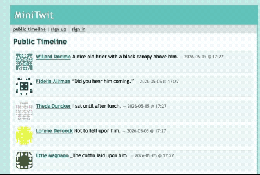

# DevOps26 RE MiniTwit

## Description / Overview

**DevOps26 RE MiniTwit** is a production-style microblogging stack for the **ITU DevOps** course: 

- **MiniTwit** in **Go** (Gin) with sessions and HTML templates,**PostgreSQL** via **GORM AutoMigrate**, a **simulator-compatible HTTP API**, and **Docker Swarm** on **DigitalOcean**.
- Observability uses **Prometheus**, **Loki**, **Grafana**, and **Promtail**. 
- **Terraform** provisions the VPC, firewalls, and droplets; **Ansible** installs Docker Engine, bootstraps Swarm, and deploys the stack. 
- **GitHub Actions** runs lint and tests, builds images, and deploys to **staging** (pull requests) or **production** (`main`).

It is aimed at **course teams and reviewers** who need a clear path from local quality checks to cloud provisioning and deployment.

## Demo and Links

**Public production deployment:** The [**MiniTwit**](https://runtimetwiterror.dev) is a public site.



**Simulator API**, **Grafana**, and **Prometheus** are treated as **operator / automation** surfaces and are locked down differently (see below).
- **Simulator API (`/api/…`)** — Every route under `/api` requests a valid Basic Authorization.
- **Grafana (`/grafana/`)** — On the public hostname, but enforces sign-in. Access to the interface [here](https://runtimetwiterror.dev/grafana).
- **Prometheus** — Only accessible inside the Swarm.

## Installation

### Prerequisites

- **Go** (see `go.mod` for the toolchain version)
- **Docker** and Docker Compose (for local integration tests)
- **Node.js** and **npm** (for `htmlhint` in lint and CI)
- **Python 3** with `pip` (for `yamllint`; tests use Compose-driven containers)
- **Terraform**, **Ansible**, and **SSH** access to DigitalOcean (for infrastructure and one-click-style provisioning)
- A **DigitalOcean** account, API token, and an **SSH key** registered in DO

### Clone and tooling

```bash
git clone https://github.com/DevOps26-RE/DevOps26_RE_minitwit.git
cd DevOps26_RE_minitwit
make install-tools   # gofumpt, npm deps, yamllint; install golangci-lint separately if needed
```

## Usage

### Static analysis (local quality gate)

```bash
make lint
```

This runs `gofumpt`, `golangci-lint`, `hadolint` (via Docker in the Makefile), `htmlhint`, and `yamllint`.

### Integration tests (ephemeral stack)

```bash
docker compose -f docker-compose-tests.yaml up --build --abort-on-container-exit --exit-code-from test
docker compose -f docker-compose-tests.yaml down -v   # clean up volumes after a run
```

### CI/CD (GitHub Actions)

On **push** and **pull_request** to `main`, [`.github/workflows/main.yml`](.github/workflows/main.yml) runs static analysis, tests, builds and pushes Docker images, then deploys over SSH with `docker stack deploy`. 

**Releases** are created from tags matching `v*` via [`.github/workflows/release.yml`](.github/workflows/release.yml). 

**Database compose** updates on the DB droplet are **manual** via [`.github/workflows/deploy-db.yml`](.github/workflows/deploy-db.yml) (stage vs prod, short downtime).

To **provision DigitalOcean droplets and bootstrap Docker Swarm** from this repo (Terraform + Ansible), use the single walkthrough in [**Infrastructure provisioning**](#infrastructure-provisioning) below—not duplicated here.

## Features

- **MiniTwit in Go** with Gin, sessions, bcrypt passwords, and HTML templates
- **Simulator API** and metrics endpoints for course tooling
- **PostgreSQL** with **GORM AutoMigrate** (schema follows Go models; no hand-maintained `schema.sql` in the happy path)
- **Docker Swarm** stack: Traefik (TLS on production), app replicas, monitoring configs as Swarm configs
- **Dedicated DB/monitoring node** vs **app/manager nodes** for clearer scaling and failure isolation
- **Observability**: Prometheus, Loki, Grafana, Promtail (configs under `prometheus/`, `loki/`, `grafana/`, `promtail/`)
- **GitHub Actions**: lint → test → build/push → deploy; PR comments with image tag; optional **Release** and **Deploy DB** workflows
- **Infrastructure as code:** Terraform creates the DO VPC, droplets, and firewall; Ansible installs Docker, forms Swarm, deploys the DB compose stack and `docker stack deploy` (stage runs Ansible from Terraform `local-exec` when SSH works). Full steps: [**Infrastructure provisioning**](#infrastructure-provisioning).

## Tech Stack / Built With

| Layer | Technologies |
| :--- | :--- |
| **Application** | Go, Gin, GORM, PostgreSQL driver, Gin sessions, Prometheus client |
| **Frontend** | HTML templates, static assets (`static/`, `templates/`) |
| **Containers** | Docker, Docker Compose, multi-stage Dockerfile (`docker/Dockerfile-app`, `docker/Dockerfile-test`) |
| **Orchestration** | Docker Swarm (`docker-stack.yml`), Traefik v3 |
| **Infrastructure** | DigitalOcean (Droplets, VPC, firewall), Terraform, Ansible |
| **CI/CD** | GitHub Actions, Docker Buildx, Docker Hub |
| **Quality** | gofumpt, golangci-lint, hadolint, htmlhint, yamllint (`Makefile`, `golangci.yml`) |
| **Tests** | Docker Compose test stack, Python tests and simulator under `test/` |

## Project Structure

Paths are relative to the repository root, in a logical reading order.

| Path | Description |
| :--- | :--- |
| [`.github/workflows/`](.github/workflows/) | CI/CD (`main.yml`), release on `v*` tags (`release.yml`), manual DB compose deploy (`deploy-db.yml`) |
| [`ansible/`](ansible/) | `site.yml`, `ansible.cfg`, `roles/docker_app/` — Docker Engine, Swarm join, copy stack files, deploy DB compose and Swarm stack |
| [`docker/`](docker/) | `Dockerfile-app`, `Dockerfile-test` — production and test images |
| [`docs/`](docs/) | Supplementary notes (logging, CI quality gate, GORM) |
| [`grafana/`](grafana/) | Grafana datasource provisioning |
| [`loki/`](loki/) | Loki configuration |
| [`prometheus/`](prometheus/) | Prometheus scrape and alert rules |
| [`promtail/`](promtail/) | Promtail shipper configuration |
| [`static/`](static/) | CSS and static assets |
| [`templates/`](templates/) | Gin HTML templates |
| [`test/`](test/) | Python integration/UI tests, simulator, `requirements.txt`, `run_all_tests.sh` |
| [`terraform/stage/`](terraform/stage/) | Staging DigitalOcean resources, generated `inventory_stage.ini` and `.env.stage`, local-exec Ansible |
| [`terraform/production/`](terraform/production/) | Production DigitalOcean resources, `inventory_prod.ini`, `.env.prod` with `runtimetwiterror.dev` |
| [`tmp/legacy/`](tmp/legacy/) | Archived course artifacts (examples only; not used by the running system) |
| [`docker-stack.yml`](docker-stack.yml) | Swarm stack: Traefik, app, monitoring services |
| [`docker-compose-db.yaml`](docker-compose-db.yaml) | PostgreSQL (and related) on the DB node |
| [`docker-compose-tests.yaml`](docker-compose-tests.yaml) | Ephemeral CI/local test stack |
| [`Makefile`](Makefile) | Lint and formatter entrypoints |
| [`go.mod`](go.mod) / [`go.sum`](go.sum) | Go module definition and checksums |
| [`golangci.yml`](golangci.yml) | golangci-lint configuration |
| [`.htmlhintrc`](.htmlhintrc) / [`.yamllint`](.yamllint) | HTML and YAML lint rules |
| [`package.json`](package.json) | npm scripts / devDependency for htmlhint |
| [`minitwit.go`](minitwit.go) | Main web application entrypoint |
| [`simulator_api.go`](simulator_api.go) | Simulator API entrypoint |
| [`monitor.go`](monitor.go) | Monitoring/metrics-related entrypoint |
| [`logger.go`](logger.go) | Logging helpers |

**Historical files (kept for course process documentation only, not part of the current stack):** `Vagrantfile`, `Vagrantfile_staging` — do not use these for deployment; follow [**Infrastructure provisioning**](#infrastructure-provisioning) instead.

## Architecture notes

- **Node roles:** App traffic and Swarm managers on **manager** nodes; **database and monitoring** concentrated on the leader/DB node for persistence and heavier workloads.
- **Schema:** GORM **AutoMigrate** keeps the database aligned with Go models (no parallel hand-written schema as the source of truth).
- **Secrets vs variables:** GitHub **Secrets** for tokens and keys; **Variables** for hosts, domains, and non-secret configuration (see [Required GitHub Actions variables and secrets](#required-github-actions-variables-and-secrets)).

## Infrastructure provisioning

Terraform provisions the DigitalOcean **VPC, firewalls, and droplets**. **Ansible** then installs Docker Engine, initializes or joins **Docker Swarm**, copies `docker-stack.yml` and monitoring configs, starts **`docker-compose-db.yaml`** on the DB/leader node, and runs **`docker stack deploy`**. In **staging**, Terraform’s `local-exec` runs Ansible automatically once SSH to the new hosts succeeds (see `terraform/stage/main.tf`). You can also run Ansible yourself if you skip or change that provisioner.

### 1. Credentials (required for every `terraform apply`)

On the machine that runs Terraform, export your DigitalOcean API token and the **name** of an SSH key already registered in DigitalOcean:

```bash
export TF_VAR_do_token="$DIGITAL_OCEAN_TOKEN"
export TF_VAR_ssh_key_name="$SSH_KEY_NAME"
```

Details for each variable live in `terraform/stage/variables.tf` and `terraform/production/variables.tf`. **Terraform state is sensitive** and must stay out of Git (already gitignored).

### 2. Staging — recommended for testers (“one path” end-to-end)

From the repo root:

```bash
cd terraform/stage
terraform init
terraform plan
terraform apply
```

**What this does:** creates the stage VPC, droplets, and firewall; writes `ansible/inventory_stage.ini` and repo-root `.env.stage` (staging **`DOMAIN`** uses **nip.io** on manager 1’s public IP); runs Ansible over SSH to bring up Swarm and the stack.

**Verify:** SSH to a manager and run `docker service ls`; open the **HTTP** URL from `.env.stage` (the `DOMAIN=…nip.io` line) for the web UI. The simulator uses **`/api`** with Basic Auth (see application code).

**State locks:** If a previous run left a lock, use `terraform init -reconfigure` or resolve the lock in your backend before forcing `-lock=false`.

### 3. Production — same tool chain, different contract

```bash
cd terraform/production
terraform init
terraform plan
terraform apply
```

The generated `.env.prod` pins **`DOMAIN=runtimetwiterror.dev`**. Traefik uses **Let’s Encrypt** for that hostname. If you **reprovision new droplets**, you **must update DNS** for `runtimetwiterror.dev` (and related records) to the new ingress IPs; otherwise certificates and routing will not match the live domain. **Testers should prefer staging** for a full run without DNS changes; production is tied to the group’s real domain and simulator expectations.

### 4. Ansible only (manual rerun or no Terraform provisioner)

If you already have `inventory_*.ini` and `.env.*` on disk:

```bash
cd ansible
ANSIBLE_CONFIG=./ansible.cfg ansible-playbook -i inventory_stage.ini -e stack_env_file=../.env.stage site.yml
# ansible-playbook -i inventory_prod.ini -e stack_env_file=../.env.prod site.yml
```

`ansible.cfg` relaxes host key checking so automation can reach freshly created droplets.

## Required GitHub Actions variables and secrets

Configure these under **Settings → Secrets and variables → Actions** for a fork or new remote.

### Secrets

| Secret | Description |
| :--- | :--- |
| `DOCKERHUB_TOKEN` | Docker Hub access token for pushing images |
| `DO_SSH_KEY` | Private SSH key for production manager |
| `DO_SSH_KEY_STAGE` | Private SSH key for staging manager |
| `APP_SECRET_KEY` | Session secret (production) |
| `APP_SECRET_KEY_STAGE` | Session secret (staging) |

### Variables

| Variable | Description |
| :--- | :--- |
| `DOCKERHUB_USERNAME` | Docker Hub username |
| `DO_USER` | SSH user (e.g. `root`) |
| `DOMAIN` | Production hostname (`runtimetwiterror.dev`) |
| `DOMAIN_STAGE` | Staging hostname or IP used by Actions |
| `DO_HOST` / `DO_HOST_STAGE` | Public IP of manager 1 (prod / stage) |
| `DO_HOST_2` / `DO_HOST_2_STAGE` | Public IP of manager 2 |
| `DB_PUBLIC_IP` / `DB_PUBLIC_IP_STAGE` | DB droplet public IP (maintenance SSH) |
| `DB_PRIVATE_IP` / `DB_PRIVATE_IP_STAGE` | DB private VPC IP for app connections |

## Contributing

Pull requests should pass **`make lint`** and the **Compose test** workflow locally when possible. Pin or comment action SHAs if you upgrade workflows. For infrastructure changes, coordinate Terraform state and DNS with the team before applying production.

## License

This project is created for educational purposes. It currently does not have an open-source license. 

Please contact the repository maintainers or refer to the course policies before reusing this code.

## Credits / Acknowledgments

### ITU DevOps Course
This project is built upon the **MiniTwit** exercise and simulator expectations provided by the course instructors.

### Team Members
- Aiting <aile@itu.dk>
- Amanda <amli@itu.dk>
- Elias <elpo@itu.dk>
- Johannes <jhac@itu.dk>
- Jakub <jgaj@itu.dk>