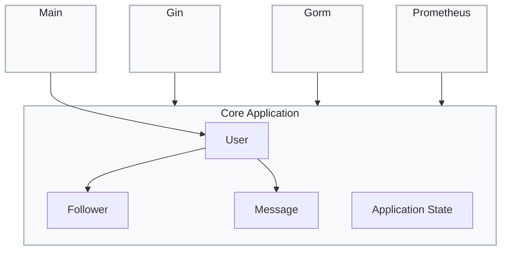
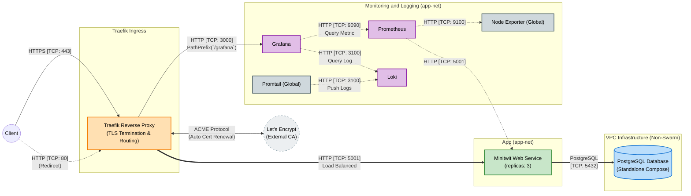
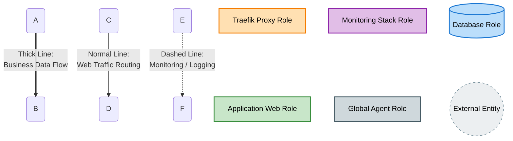
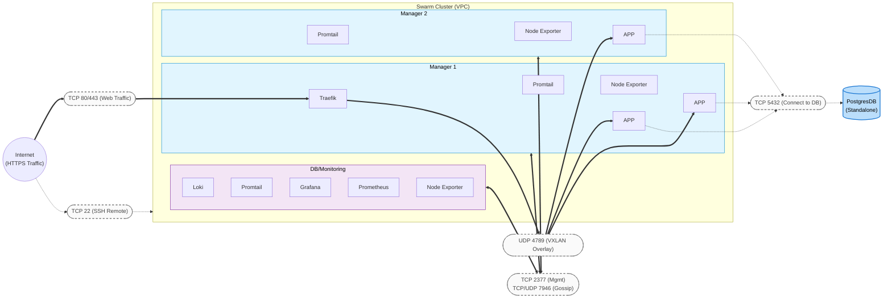
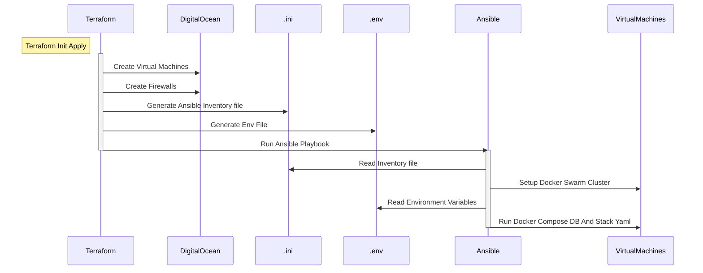

# ITU-MiniTwit — Final Report (Main Index)

<!-- Formal requirements checklist (verify against the full course brief before writing / exporting PDF):
  - Maximum ~2500 words for the final report; figures do not count toward the word limit.
  - Sources must be in a markup language (this repo uses Markdown) and version-controlled here.
  - Place all report images under report/images/ (e.g. report/images/demo.gif).
  - CI must build a single PDF from the report sources into report/build/, filename must match: MSc_group_[a-z].pdf (e.g. MSc_group_a.pdf).
  - Link and briefly describe constitutional artifacts: repos, issue trackers, monitoring/logging, etc. (see appendix after expansion).
-->

<!-- Edit this file (main.template.md). Run `make report` to expand @include lines into report/main.md for PDF/GitHub preview. -->

## Abstract

<!-- One short paragraph. You may draft this after the body is complete. -->

## Outline

| Perspective | Topics |
|-------------|--------|
| [System](#system-perspective) | Architecture, dependencies, static analysis and quality |
| [Process](#process-perspective) | CI/CD, monitoring, logging, security, availability and scaling |
| [Reflection](#reflection-perspective) | Issues and lessons, evolution/ops/maintenance, DevOps-style work |
| [Appendix](#appendix) | External artifact links |

# System's Perspective

A description and illustration of the:
- Design and architecture of your ITU-MiniTwit systems.
- All dependencies of your ITU-MiniTwit systems on all levels of abstraction and development stages. That is, list and briefly describe all technologies and tools you applied and depend on. 
- Describe the current state of your systems, for example using results of static analysis and quality assessments.

<!-- Cover: MiniTwit design and architecture (with diagrams), dependencies and tools at each abstraction level and development stage, and the current state from static analysis and quality assessments. -->

## Design and architecture

<!-- Describe and illustrate: service boundaries, data flows, deployment topology (Swarm / node roles), main components (app, DB, Traefik, observability stack, etc.). -->

### Module Viewpoint

### Component and Connector Viewpoint

### Allocation Viewpoint

#### Deployment View
### Minitwit Deployment Infrastructure (VPC Private Network)

#### Graph Key & Legend

#### One Click Deployment Flow Chart

## Dependencies and technology stack

<!-- List and briefly describe: languages, frameworks, DB, orchestration, IaC, CI platform, observability components, etc. -->

## Static analysis and quality

<!-- e.g. make lint, golangci-lint, test coverage, integration-test strategy; optional trends or screenshots (store images under report/images/). -->

# Process' Perspective

This perspective should clarify how code or other artifacts come from idea into the running system and everything that happens on the way.
In particular, the following descriptions should be included:
- A complete description and illustration of stages and tools included in the CI/CD pipelines, including deployment and release of your systems.
- How do you monitor your systems and what precisely do you monitor?
- What do you log in your systems and how do you aggregate logs?
- Brief description of how you security hardened your systems.
- How do you handle availability and scaling in your systems?

<!-- Section bodies live under sections/*.md (one file per topic). @include lines are expanded when you run `make report` (report/main.template.md → report/main.md). -->

## CI/CD pipelines, deployment, and release

<!-- Describe and illustrate stages (lint, test, build, deploy); staging vs production, tag-based releases, manual DB workflows, etc. -->

## Monitoring

<!-- What you monitor, which tools (Prometheus, Grafana, …), key metrics and dashboard links (may reference appendix). -->

## Logging

<!-- What you log and how logs are aggregated (Loki, Promtail, …). -->

## Security hardening

<!-- Brief notes: authentication, TLS, network isolation, Basic Auth, secrets handling, etc. -->

## Availability and scaling

Our Minitwit service runs on a 3-node Docker Swarm in DigitalOcean. Two manager nodes run 3 replicas of the Minitwit app, while the third node runs the database and monitoring stack. Node roles are defined via Terraform resource groups, which Ansible uses to apply Docker Swarm placement labels during provisioning. Services in `docker-stack.yml` are constrained to nodes with matching labels, and Swarm automatically reschedules replicas if a node goes down.

The database can only be scaled vertically (larger VM). The application supports horizontal scaling by adding droplets to the Terraform configuration and assigning them the ingress role.

When deploying a new version, Swarm performs a rolling update: each new replica starts before the old one stops (`order: start-first`), keeping at least two instances available throughout. If the new container fails to start, Swarm automatically rolls back (`failure_action: rollback`). Silent failures — where the container starts but behaves incorrectly — are not caught automatically; the CI/CD test suite is the primary guard here.

**Known limits:** The database is a single point of failure with no replication or automated backups. Traefik runs as a single replica, so if its host node fails, ingress is lost until Swarm reschedules it. The app containers have no health checks beyond TCP port availability, so a broken-but-running instance will continue receiving traffic.

# Reflection Perspective

Describe the biggest issues, how you solved them, and which are major lessons learned with regards to:
- evolution and refactoring
- operation, and
- maintenance
of your ITU-MiniTwit systems. Link back to respective commit messages, issues, tickets, etc. to illustrate these.

Also reflect and describe what was the "DevOps" style of your work. For example, what did you do differently to previous development projects and how did it work?

Use of Generative AI

ITU's rules on the use of generative AI apply for this report too. They are described here and in detail here. Please follow them. For your report that means that you have to state which generative AI tools have been used for which task(s) in your projects. Additionally, describe how generative AI tools have been used and briefly reflect and discuss how they supported or hindered your work process.

<!-- Cover: major issues and how you solved them; lessons on evolution/refactoring, operation, and maintenance. Link to commits, issues, tickets. Reflect on your DevOps-style work vs previous projects. -->

## Major issues, resolutions, and lessons learned

### Evolution and refactoring

<!-- Link: relevant commits / PRs / issues. -->

### Operation

<!-- Link: on-call, incidents, alerts (if any). -->

### Maintenance

<!-- Link: technical debt, documentation, dependency upgrades, etc. -->

## DevOps-style work compared to earlier projects

<!-- e.g. automation, small batches, IaC, observability-first practices. -->

## Use of Generative AI

<!-- e.g. how we use ai. -->

# Appendix — Linked artifacts
Just a placeholder for now
<!-- List each constitutional artifact with a one-line description and URL. Replace placeholders with your real links. -->

## Source code and version control

<!-- - Main repository: ... -->

## Issue tracking

<!-- - GitHub Issues / Projects: ... -->

## Monitoring, logging, and dashboards

<!-- - Grafana: ... -->
<!-- - If not public, describe how reviewers can access it. -->

## Other

<!-- - Simulator API docs, course wiki, additional documentation repos, etc. -->

## Figures and illustrations

<!-- Use relative paths from report/main.md after expansion, e.g.  -->
