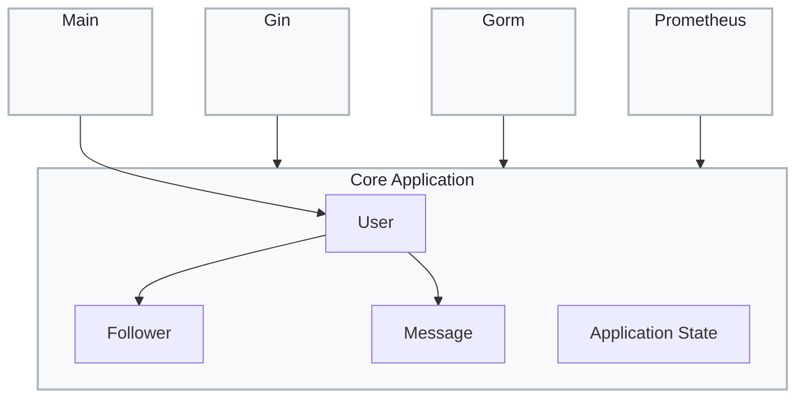
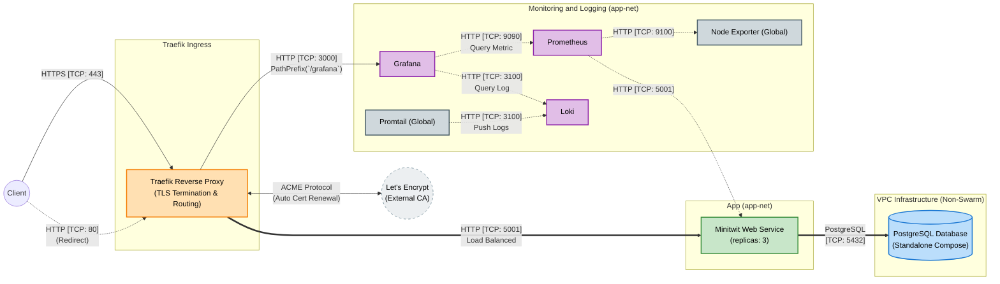
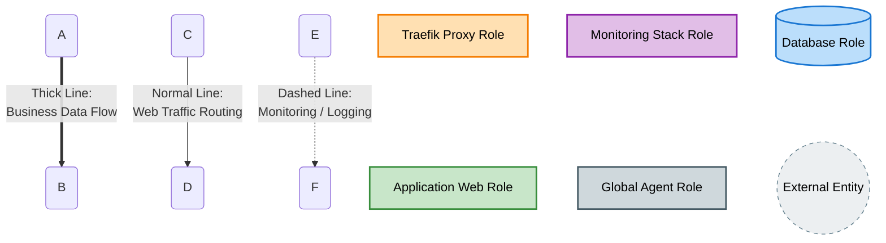
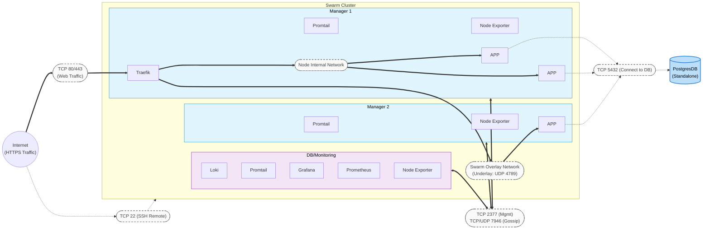
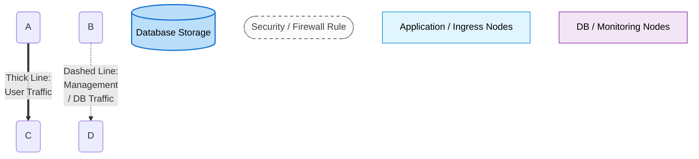
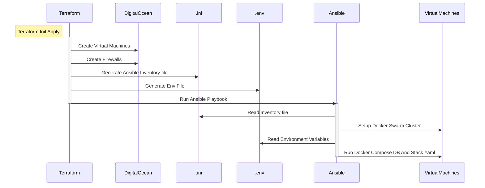

# ITU-MiniTwit: Final Report

<a id="system-perspective"></a>

# System Perspective

This section details the architecture, dependencies and quality assessment of the ITU-MiniTwit system. We describe the service boundaries and data flows through multiple viewpoints and list the technologies used to build and deploy the application.


## Design and architecture

<!-- Describe and illustrate: service boundaries, data flows, deployment topology (Swarm / node roles), main components (app, DB, Traefik, observability stack, etc.). -->

### Module Viewpoint
#### Module View

This view illustrates the static package structure and dependency flow of the Minitwit codebase, adhering to Clean Architecture principles:

* **Core Application:** Encapsulates the pure business logic and domain entities (`User`, `Follower`, `Message`, `Application State`). It remains strictly isolated and framework-agnostic.
* **External Frameworks:** Infrastructure packages (`Gin` for HTTP routing, `Gorm` for database ORM, and `Prometheus` for metrics) depend *inward* on the Core Application. This ensures the domain logic is completely decoupled from specific technology choices.
* **Main Package:** Acts as the application's entry point, wiring up the necessary dependencies and triggering the core logic.




### Component and Connector Viewpoint
#### Component and Connector View

The following view describes the components of the Minitwit system and the specific network protocols (connectors) used for interaction:

* **External Connectors:** The Traefik proxy component receives user traffic via HTTPS (TCP 443) and communicates with Let's Encrypt using the ACME protocol for automated TLS certificate management.
* **Application Routing:** Traefik load-balances incoming requests to the 3 Minitwit Web Service components over HTTP (TCP 5001).
* **Data Persistence:** The web application components interact with the standalone PostgreSQL database component using the native Postgres protocol (TCP 5432).
* **Observability Connectors:**
  * **Metrics (Pull):** The Prometheus component scrapes telemetry data via HTTP from the application (TCP 5001) and global Node Exporters (TCP 9100).
  * **Logs (Push):** Promtail agents stream logs to the Loki component over HTTP (TCP 3100).
  * **Visualization:** Grafana queries both Prometheus (TCP 9090) and Loki (TCP 3100) via HTTP to render dashboards.




### Allocation Viewpoint

#### Deployment View

This is the deployment view for our 3-node Minitwit Swarm cluster:
* **Cluster Topology:** The environment consists of 3 virtual machines. All act as Swarm Managers to maintain a highly available cluster, ensuring seamless leader election if a node fails.
* **Workload Allocation:** 
  * **Node 1:** Acts as the ingress node, hosting the Traefik proxy.
  * **Node 1 & 2:** Host the distributed Minitwit application replicas.
  * **Node 3:** Dedicated to the centralized observability stack (Grafana, Prometheus, Loki).
  * **Global:** Promtail and Node Exporter agents are deployed universally across all three nodes.
* **External Infrastructure:** The PostgreSQL database is deployed on the Node 3 through a docker compose, outside the Swarm cluster, but remains secured within the same VPC.
* **Network Infrastructure:**
  * **Control Plane:** Swarm management and node discovery (TCP 2377, 7946) operate on a dedicated infrastructure bus.
  * **Data Plane:** Inter-node container traffic is encapsulated via the Swarm Overlay network (UDP 4789), while intra-node traffic is routed directly through local network.



#### One-Click Deployment Pipeline

This sequence diagram illustrates our automated, end-to-end deployment process:

* **Infrastructure Provisioning:** Terraform initializes and provisions the core infrastructure (Virtual Machines and firewalls) on DigitalOcean.
* **Dynamic Configuration:** Terraform automatically generates the required Ansible inventory (`.ini`) and environment variables (`.env`) locally based on the provisioned resources.
* **Automated Handoff:** Terraform seamlessly triggers the Ansible playbook execution.
* **Cluster Setup & Deployment:** Ansible reads the generated configurations to initiate the Docker Swarm cluster and deploy the application stack (along with the database) directly onto the virtual machines.



## Dependencies and technology stack

This project’s core application is written in Go (1.25) using Gin for routing, Gin sessions for auth state, GORM with the PostgreSQL driver for persistence and Prometheus client libraries for app metrics. The UI is server-rendered from HTML templates plus static assets. Locally and in CI, Docker Stack provisions the app, PostgreSQL, Selenium and Python-based integration tests. Production deployment uses Docker Swarm with Traefik as ingress and TLS termination. Infrastructure is managed as code with Terraform (DigitalOcean VPC, droplets, firewalls) and Ansible (Docker/Swarm initiate and deploy). Observability is handled by Prometheus, Loki, Promtail, Grafana and Node Exporter; CI/CD runs in GitHub Actions.

## Static Analysis and Quality

<!-- e.g. make lint, golangci-lint, test coverage, integration-test strategy; optional trends or screenshots (store images under report/images/). -->

We enforce code quality through a two-layered static analysis pipeline in GitHub Actions.

**Layer 1: Language-specific linters**
These tools run on every pull request to catch syntax issues and enforce formatting:
- `gofumpt`: automatically formats Go code and commits style fixes
- `golangci-lint`: performs comprehensive Go static analysis and security checks
- `hadolint`: enforces Dockerfile best practices
- `htmlhint`: validates HTML structure
- `yamllint`: checks YAML syntax and indentation

Formatting issues are corrected automatically where possible. Errors or security warnings fail the pipeline with file and line number indicators. Developers can run `make lint` locally to receive the same feedback before pushing.

**Layer 2: SonarQube Cloud**
SonarQube performs deeper cross-language analysis to scan for bugs, security vulnerabilities and code smells. It is integrated with GitHub to provide real-time inline feedback on pull requests.
Our current SonarQube rating is as follows: Security Rating is an E with 18 unsolved issues; Security Hotspot is an E with 9 unsolved issues; Reliability is an A with 1 unsolved issue; and Maintainability is an A with 29 unsolved issues.
<a id="process-perspective"></a>

# Process Perspective

This section describes the lifecycle of code from development to production. We outline the CI/CD pipeline, the observability stack for monitoring and logging, security measures and our approach to availability and scaling.

## CI/CD pipelines, deployment and release

Our delivery process evolved incrementally from manual operations to commit-driven automation:

1. **Manual local phase (Python):** The project started as a local Python app with manual startup/testing. We used helper bash scripts for local control (legacy examples are still kept under `tmp/legacy/`).
2. **Containerized but still manual:** We then introduced Docker, but builds and runs were still triggered manually on local machines.
3. **Vagrant + DigitalOcean provisioning:** Next, we used `Vagrantfile`-based provisioning for droplets. Early provisioning relied on inline shell scripts (Docker install, DB/app startup, IP handoff via `db_ip.txt`), so deployment was cloud-based but still operator-driven.
4. **Ansible replacing shell provisioning:** We migrated host setup and deployment logic into Ansible (`ansible/site.yml`, `ansible/roles/docker_app`), making start and re-runs more repeatable.
5. **GitHub Actions CI/CD adoption:** We added commit-triggered automation in `.github/workflows/main.yml`, moving from manual build/deploy to pipeline-based quality gates, image build/push and remote deployment.
6. **Pipeline hardening and release split:** The pipeline matured into lint → test → build/push → deploy, with branch-aware image tags and PR traceability comments; releases were separated into `release.yml` (`v*` tags).
7. **Environment separation + controlled DB updates:** We introduced stage/prod handling and a dedicated manual DB workflow (`deploy-db.yml`) because DB compose updates can cause brief downtime and require explicit operator intent.
8. **Terraform + Ansible one-click deployment:** Finally, infrastructure provisioning moved to Terraform (`terraform/stage`, `terraform/production`), which generates inventory/env artifacts and triggers Ansible via `local-exec` to start a full environment.

The current operating model is therefore: **Terraform + Ansible for environment creation** and **GitHub Actions for ongoing application delivery per commit**. Historical files such as `Vagrantfile` and `Vagrantfile_staging` remain in the repository for process documentation but are no longer the primary deployment path.

## Monitoring

<!-- What you monitor, which tools (Prometheus, Grafana, …), key metrics and dashboard links (may reference appendix). -->

Monitoring is split across two tools: Prometheus for metrics and Loki for logs. Both visualized through Grafana, with both datasources provisioned automatically on deployment (no manual setup required).

### Metrics (Prometheus)

Prometheus scrapes two targets every 15 seconds:

- **Application**: the `/metrics` endpoint exposed on port 5001.
- **Node Exporter**: running on every Swarm node, discovered via DNS service discovery (`tasks.node_exporter`).

The application instruments two custom metrics via a `PrometheusMiddleware`:

| Metric | Type | Labels | Purpose |
|---|---|---|---|
| `minitwit_http_requests_total` | Counter | `method`, `path`, `status` | Tracks total request volume; rate gives requests/sec |
| `minitwit_http_request_duration_seconds` | Histogram | `method`, `path` | Bucketed from 10ms to 10s; enables p50/p95/p99 calculations |

The route template (e.g. `/:username`) is used instead of the raw path to prevent unbounded label cardinality. Node Exporter provides host-level metrics including CPU and memory utilisation.

### Visualization (Grafana)

Two dashboards are maintained:

**Metrics dashboard** (Prometheus datasource):

- **CPU utilisation**: shows host CPU usage over time per node; helps detect runaway processes or traffic spikes. A color indicator reflects current consumption: green (healthy), yellow (moderate), red (critical).
- **Memory utilisation**: tracks RAM usage per node; useful for catching memory leaks. Same green/yellow/red color coding indicates current memory pressure at a glance.
- **HTTP request rate**: derived from `minitwit_http_requests_total`; shows how many requests/sec the app is handling.
- **Average & p95 response time**: derived from the duration histogram; p95 highlights tail latency that averages would hide.
- **Successful requests**: counts 2xx responses; a sudden drop signals an outage or regression.
- **Traffic by endpoint**: breaks request rate down by route template; reveals which endpoints are under the most load.

**Log dashboard** (Loki datasource):

- **Overall traffic**: log volume over time across all services; a quick sanity-check for whether the app is receiving requests.
- **Database errors**: filters for error-level log lines from the `db` service; these panels may not function correctly due to incomplete error handling in the application code.
- **Service errors**: filters for error-level log lines from the web service; same caveat applies.

Grafana's Explore view allows correlating a spike in a Prometheus graph with the corresponding Loki log lines from the same time window, enabling faster incident investigation.

## Logging

<!-- What you log and how logs are aggregated (Loki, Promtail, …). -->

The application emits one structured JSON log line per HTTP request to stdout, produced by a `LoggingMiddleware` built on Go's `slog` package. Writing to stdout requires no direct coupling to the log storage backend. Docker captures container stdout automatically.

Each log entry contains the following fields:

| Field | Example | Description |
|---|---|---|
| `method` | `GET` | HTTP verb |
| `path` | `/alice` | Raw request path |
| `route` | `/:username` | Gin route template, avoids high-cardinality labels |
| `status` | `200` | HTTP response status code |
| `latency_ms` | `12` | Request duration in milliseconds |
| `client_ip` | `1.2.3.4` | Originating IP (respects X-Forwarded-For) |
| `user_agent` | `Mozilla/5.0 …` | Browser or client identifier |
| `bytes_out` | `1024` | Response body size in bytes |

### Log Aggregation

**Promtail** runs as a `global` service in the Docker Swarm (one instance per node). It connects to the Docker daemon via the Unix socket (`/var/run/docker.sock`) and automatically discovers all running containers, tailing their stdout and stderr, no hardcoded service names required.

Each log line is forwarded to **Loki** with three labels:

- **`service`**: Docker Compose service name (e.g. `web`). Used to scope queries to a single service, e.g. `{service="web"}`.
- **`container`**: Full container name (e.g. `minitwit-web-1`). Useful when multiple replicas run side by side and you need to isolate one instance.
- **`stream`**: Either `stdout` or `stderr`. Allows filtering out noisy stderr from libraries while keeping application logs clean.

These low-cardinality labels keep Loki queries efficient.

### Storage & Querying

Loki uses a single-node filesystem-backed setup with **7-day retention**. Logs are queryable via LogQL. The following queries are used in the Grafana dashboards:

```logql
# All logs from the web service
{service="minitwit_web"}

# All logs from any web container replica (regex match)
{container=~"minitwit_web.*"}

# Server errors (status >= 500)
{service="web"} | json | status >= 500

# Slow requests (latency > 1 second)
{service="web"} | json | latency_ms > 1000

# Error-level log lines
{service="minitwit_web"} | json | level =~ `(?i)error`
{service="db"} | json | level =~ `(?i)error`

# Timeout events
{service="minitwit_web"} |= "timeout"
{service="db"} |= "timeout"
```

## Security hardening

Security is handled across the application, network and deployment pipeline. The following sections highlight specific implementations within the codebase.

### SQL Injection Prevention (GORM)
Raw SQL strings were replaced with GORM. It automatically parameterizes queries to prevent injection vulnerabilities. For example, in `minitwit.go`, user lookups are handled safely without string concatenation:

```go
// minitwit.go
func get_user_id(username string) (int, error) {
	var user User
	// GORM safely parameterizes the QueryUsername ("username = ?") variable
	result := db.Where(QueryUsername, username).First(&user)
	// ...
}
```

### Network Isolation and Firewalls
DigitalOcean firewalls restrict public ingress to HTTP and HTTPS. Internal Swarm traffic, SSH and the PostgreSQL database are isolated within a private VPC. This is defined as infrastructure-as-code in `terraform/production/main.tf`:

```hcl
# terraform/production/main.tf
resource "digitalocean_firewall" "minitwit_fw" {
  name = "minitwit-prod-firewall"
  # ...
  inbound_rule {
    protocol         = "tcp"
    port_range       = "443"
    source_addresses = ["0.0.0.0/0", "::/0"]
  }
  # Internal traffic restricted to VPC IP range
  inbound_rule {
    protocol         = "tcp"
    port_range       = "5432" # PostgreSQL
    source_addresses = [digitalocean_vpc.minitwit_vpc.ip_range]
  }
}
```

### Data in Transit (TLS)
Traefik automatically provisions Let's Encrypt certificates for all public traffic. The routing and TLS termination are configured via Docker Swarm labels, ensuring that all external communication is encrypted before reaching the application containers.

### Secret Management
Environment variables are templated by Terraform. Highly sensitive credentials (SSH keys, Docker Hub tokens, application secrets) are injected exclusively via GitHub Secrets during CI/CD to keep them out of version control. For instance, the deployment step in `.github/workflows/main.yml` securely accesses the SSH key:

```yaml
# .github/workflows/main.yml
  deploy:
    # ...
    steps:
      - name: Deploy via SSH
        uses: appleboy/ssh-action@v1.2.1
        env:
          SECRET_KEY: ${{ github.ref == 'refs/heads/main' && secrets.APP_SECRET_KEY || secrets.APP_SECRET_KEY_STAGE }}
        with:
          key: ${{ github.ref == 'refs/heads/main' && secrets.DO_SSH_KEY || secrets.DO_SSH_KEY_STAGE }}
          # ...
```

## Availability and scaling

Our Minitwit service runs on a 3-node Docker Swarm in DigitalOcean. Two manager nodes run 3 replicas of the Minitwit app, while the third node runs the database and monitoring stack. Node roles are defined via Terraform resource groups, which Ansible uses to apply Docker Swarm placement labels during provisioning. Services in `docker-stack.yml` are constrained to nodes with matching labels and Swarm automatically reschedules replicas if a node goes down.

The database can only be scaled vertically (larger VM). The application supports horizontal scaling by adding droplets to the Terraform configuration and assigning them the ingress role.

When deploying a new version, Swarm performs a rolling update: each new replica starts before the old one stops (`order: start-first`), keeping at least two instances available throughout. If the new container fails to start, Swarm automatically rolls back (`failure_action: rollback`). Silent failures (where the container starts but behaves incorrectly) are not caught automatically; the CI/CD test suite is the primary guard here.

**Known limits:** The database is a single point of failure with no replication or automated backups. Traefik runs as a single replica, so if its host node fails, ingress is lost until Swarm reschedules it. The app containers have no health checks beyond TCP port availability, so a broken-but-running instance will continue receiving traffic.

<a id="reflection-perspective"></a>

# Reflection Perspective
## Major issues, resolutions and lessons learned
Initially each member ported part of the Python-to-Go rewrite alone, which left some disconnected; we fixed this by moving our most knowledgeable member to a pure peer-review role and holding weekly syncs.

### Maintenance
Our biggest failure was the Compose-to-Swarm migration: the deploy automation had only ever worked against Compose, so the cutover broke live and took four successive fixes to stabilise [#36–#39]. The deeper cause was treating the migration itself as the first real test of the new automation. Lesson: major infrastructure changes need a deployment path proven on staging first and shared edge components like Traefik must be decoupled so they survive migrations.

### DevOps-style work compared to earlier projects
Unlike earlier projects, a CI/CD pipeline ran analysis, staging deployment and tests on every PR <!-- We might want to link to the actual PR in which this was implemented? -->, making integration continuous rather than last-minute.
Generative AI. Used for boilerplate route porting, documentation and as a searchable interface to our own codebase; results were useful but occasionally over-complex.

### Use of Generative AI
We used generative AI for several tasks, with mixed results:

- __Documentation:__ Generating documentation for new implementations, which we used in Thursday meetings to recap the week's work.
- __As a documentation search engine:__ Querying specific, hard-to-understand parts of technologies instead of reading official docs. This sometimes worked well but sometimes produced unnecessarily complex suggestions.
- __Boilerplate porting:__ Translating the routing layer from Python to Go.
- __Understanding our own codebase:__ Feeding the full codebase to AI to "interview" it about behaviour we found unclear: most usefully, the interactions between DigitalOcean's network, Docker's network and each VM's network.

