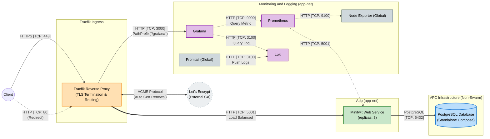
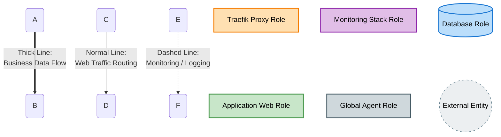

#### Component and Connector View

This view highlights the components of the Minitwit system and the specific network protocols (connectors) they use to interact:

* **External Connectors:** The Traefik proxy component receives user traffic via HTTPS (TCP 443) and communicates with Let's Encrypt using the ACME protocol for automated TLS certificate management.
* **Application Routing:** Traefik load-balances incoming requests to the 3 Minitwit Web Service components over HTTP (TCP 5001).
* **Data Persistence:** The web application components interact with the standalone PostgreSQL database component using the native Postgres protocol (TCP 5432).
* **Observability Connectors:**
  * **Metrics (Pull):** The Prometheus component scrapes telemetry data via HTTP from the application (TCP 5001) and global Node Exporters (TCP 9100).
  * **Logs (Push):** Promtail agents stream logs to the Loki component over HTTP (TCP 3100).
  * **Visualization:** Grafana queries both Prometheus (TCP 9090) and Loki (TCP 3100) via HTTP to render dashboards.

