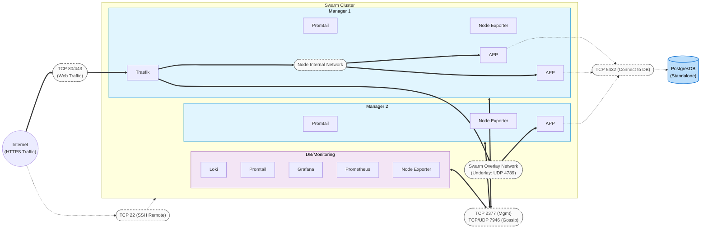
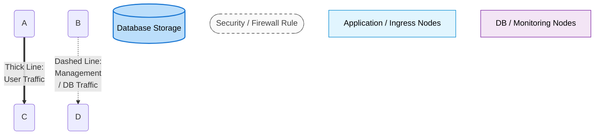

#### Deployment View

This is the deployment view for our 3-node Minitwit Swarm cluster:
* **Cluster Topology:** The environment consists of 3 virtual machines. All act as Swarm Managers to maintain a highly available quorum, ensuring seamless leader election if a node fails.
* **Workload Allocation:** 
  * **Node 1:** Acts as the ingress node, hosting the Traefik proxy.
  * **Node 1 & 2:** Host the distributed Minitwit application replicas.
  * **Node 3:** Dedicated to the centralized observability stack (Grafana, Prometheus, Loki).
  * **Global:** Promtail and Node Exporter agents are deployed universally across all three nodes.
* **External Infrastructure:** The PostgreSQL database is deployed on a standalone instance outside the Swarm cluster, but remains secured within the same VPC.
* **Network Infrastructure:**
  * **Control Plane:** Swarm management and node discovery (TCP 2377, 7946) operate on a dedicated infrastructure bus.
  * **Data Plane:** Inter-node container traffic is encapsulated via the Swarm Overlay network (UDP 4789), while intra-node traffic is routed directly through local network.

