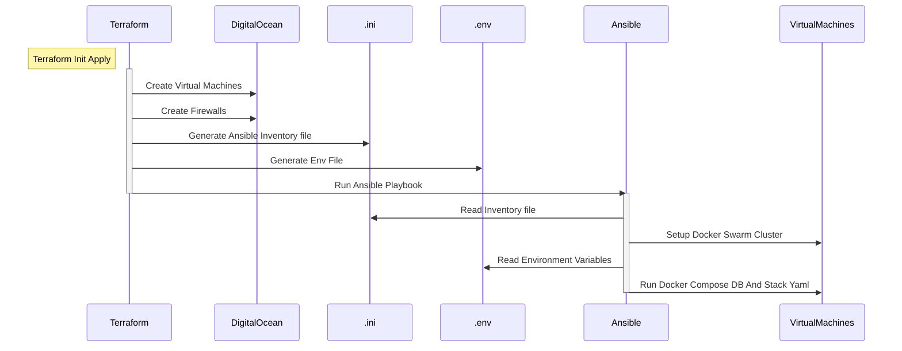

#### One-Click Deployment Pipeline

This sequence diagram illustrates our automated, end-to-end deployment process:

* **Infrastructure Provisioning:** Terraform initializes and provisions the core infrastructure (Virtual Machines and firewalls) on DigitalOcean.
* **Dynamic Configuration:** Terraform automatically generates the required Ansible inventory (`.ini`) and environment variables (`.env`) locally based on the provisioned resources.
* **Automated Handoff:** Terraform seamlessly triggers the Ansible playbook execution.
* **Cluster Setup & Deployment:** Ansible reads the generated configurations to bootstrap the Docker Swarm cluster and deploy the application stack (along with the standalone database) directly onto the virtual machines.

