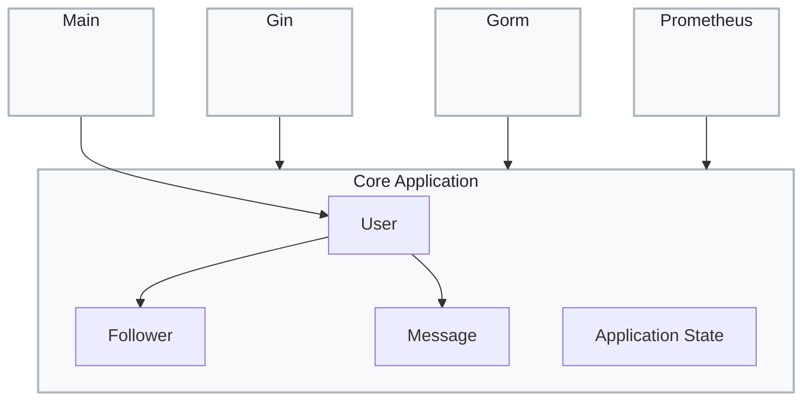

### Module View

This view illustrates the static package structure and dependency flow of the Minitwit codebase, adhering to Clean Architecture principles:

* **Core Application:** Encapsulates the pure business logic and domain entities (`User`, `Follower`, `Message`, `Application State`). It remains strictly isolated and framework-agnostic.
* **External Frameworks:** Infrastructure packages (`Gin` for HTTP routing, `Gorm` for database ORM, and `Prometheus` for metrics) depend *inward* on the Core Application. This ensures the domain logic is completely decoupled from specific technology choices.
* **Main Package:** Acts as the application's entry point, wiring up the necessary dependencies and triggering the core logic.

